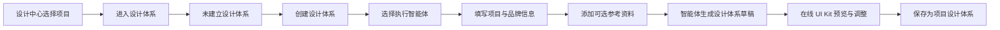
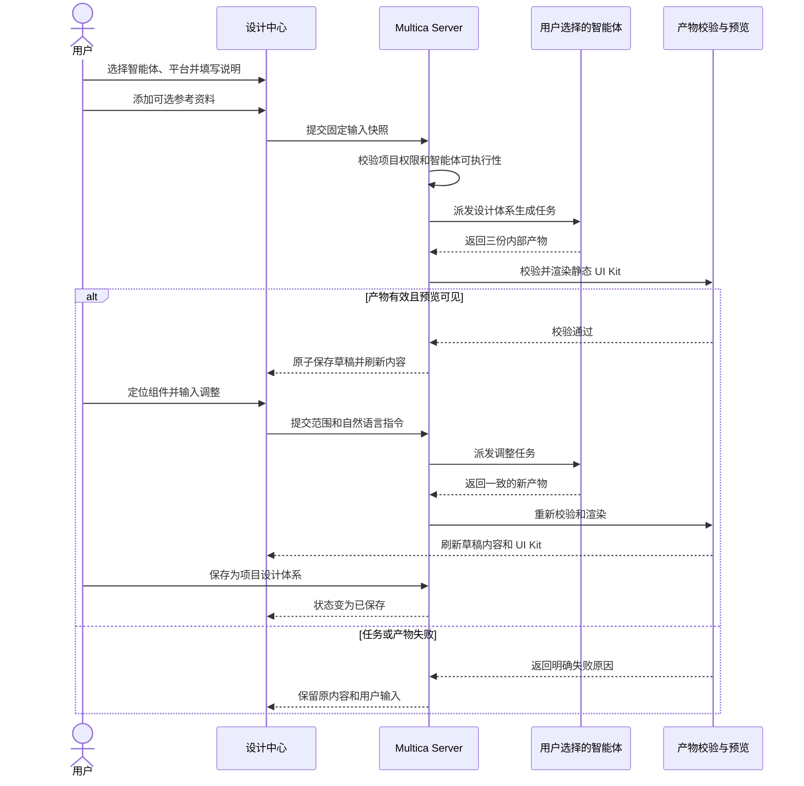

# 项目设计体系创建与管理产品规格

> 日期：2026-07-28
> 状态：待产品确认
> 范围：设计中心第一阶段的项目设计体系创建与管理闭环
> 决策依据：`docs/product/design-center/README.md`、`decision-register.md`、`open-design-evidence.md`

## 1. 背景

Multica 以项目为长期上下文，以 Issue 为需求连接和派发载体，让人和智能体共同完成需求、设计、开发与落地。设计体系是这条流水线中的项目级长期资产，不是一次 UI 智能体任务的临时 Prompt，也不是一份 Figma 文件的别名。

现有设计中心已经具备设计稿、模板和 Figma UI 规范等能力，但当前 `design_system_profile` 以 Figma 来源和分析 JSON 为中心，不能表达这次确认的产品目标。本阶段参考 Open Design 的设计体系规则和内容展示方式，先建立一条用户真正可使用的创建、生成、查看、调整和保存闭环。

本规格只定义第一阶段产品行为。旧 Profile 迁移、完整版本治理、设计任务生成和设计还原消费均不在本阶段内。

## 2. 产品目标

用户在设计中心选定项目后，可以：

1. 明确选择一个执行智能体；
2. 用自然语言描述项目定位、品牌和期望方向；
3. 选择目标平台，并按需添加已有设计资料；
4. 让选定智能体生成一套内部一致的项目设计体系草稿；
5. 在线查看真实的设计规则、视觉 Tokens、组件状态和 UI Kit；
6. 对整体、组件或内容区块提出自然语言调整；
7. 将满意的草稿保存为该项目当前设计体系。

第一阶段的成功标准不是任务显示 `completed`，也不是后台生成了若干文件，而是用户能在页面上看到一套有明确视觉方向、可实际预览、可调整并能在刷新后继续使用的项目设计体系。

## 3. 非目标

第一阶段不做以下内容：

- 不新增项目仓库扫描或项目工程分析智能体；
- 不要求先上传 Figma UI 规范；
- 不把旧 `design_system_profile` 直接改名后继续使用；
- 不迁移旧 UI 规范、默认 Profile 或历史数据；
- 不接入 UI 设计稿生成、设计还原或 Design MCP；
- 不建设 revision、binding、发布、审核、通过、驳回或审核权限；
- 不提供多套设计体系、多方案对比、主体系或弱参考体系绑定；
- 不展示内部文件树、文件名、源码编辑器或 Token 表单；
- 不建设拖拽画布、Figma 类编辑器或固定组件渲染器；
- 不生成或写回原生 Figma Components、Variants 或 Auto Layout；
- 不接入社区模板和设计任务模板。

## 4. 核心概念

### 4.1 项目设计体系

项目设计体系是某个项目当前唯一的一套设计事实源。它描述项目的视觉意图、设计规则、语义 Tokens、组件形态和状态，并能组合为可见的 UI Kit。

第一阶段每个项目最多拥有一套设计体系。项目没有设计体系是合法状态，不创建占位数据，也不触发隐藏生成任务。

### 4.2 执行智能体

执行智能体是本次生成或调整工作的明确负责人。用户必须主动选择，系统不能根据固定名称、历史记录或候选数量自动代选。

智能体选择不是设计规范表单的一部分，但它是任务发起的必填条件。

### 4.3 参考资料

参考资料用于帮助智能体理解品牌和已有视觉事实，但不是创建前置条件。第一阶段支持的产品语义包括：

- Logo 和品牌图片；
- 明确的品牌色；
- 产品截图；
- 当前项目已有的 Figma UI 规范；
- 当前项目已有的设计稿或参考设计；
- 用户补充的链接或说明。

用户当前输入的明确要求优先于可选参考资料。参考资料之间存在冲突时，智能体应遵循明确的品牌材料和当前指令，不得把互相冲突的风格机械混合。

### 4.4 在线 UI Kit

在线 UI Kit 是设计体系的真实可视化结果，不是文件预览或颜色元数据列表。它必须使用本体系 Tokens 展示实际组件、状态和具有代表性的组合区块。

## 5. 端到端流程



该图表达业务顺序，不要求把创建过程拆成多个向导步骤。第一阶段采用一个聚合创建界面完成智能体、平台、自然语言和参考资料输入，减少用户反复前进和返回。

## 6. 设计中心信息架构

### 6.1 项目范围

设计中心沿用现有项目切换能力。所有设计体系内容均以当前选中项目为范围，切换项目后必须显示对应项目的状态和内容，不能沿用上一个项目的草稿。

### 6.2 一级入口

现有设计中心的资产入口调整为：

```text
设计稿 | 模板 | 设计体系
```

现有“UI 规范”入口升级为“设计体系”。Figma UI 规范不再充当这个入口的主列表，而是在创建设计体系时作为可选参考资料被选择。

旧 UI 智能体设计稿中已有的草稿处理逻辑仍属于“设计稿”，不得与设计体系状态混合。

### 6.3 未建立状态

当前项目没有设计体系时，设计体系页面展示：

- 项目名称；
- “尚未建立设计体系”的明确状态；
- 一个主要操作“创建设计体系”。

空状态不展示虚构的 Tokens、默认规范、推荐体系或自动生成结果。

## 7. 创建界面

创建界面采用自然语言为主、结构化信息为辅的单页布局。

### 7.1 系统自动带入

- 当前项目 ID、名称和已有项目描述；
- 当前工作区；
- 用户已添加的参考资料元数据。

这些内容进入智能体任务上下文，用户不需要重复填写项目名称。

### 7.2 必填输入

#### 执行智能体

- 展示工作区内可参与派发的智能体及当前可用状态；
- 用户必须明确点选一个智能体，即使候选只有一个；
- 不可执行的智能体可以显示，但不能在没有说明原因的情况下接受派发；
- 点击生成前再次检查智能体是否仍可执行；
- 检查失败时保留所有输入，不得静默切换到其他智能体。

#### 目标平台

目标平台是唯一必选的结构化设计信息：

- Web；
- 移动端；
- 跨端。

平台决定信息密度、组件形态、触控或鼠标交互和响应式策略。系统不得由项目名称猜测平台。

#### 项目与品牌说明

主要输入是一段自然语言，用户可以描述：

- 产品定位和目标用户；
- 核心使用场景；
- 品牌气质；
- 希望保留或避免的设计特征；
- 其他对设计方向有实质影响的信息。

项目已有描述可以作为初始内容，但用户必须看到并能修改本次提交给智能体的最终说明。创建界面不要求用户逐项填写颜色、字号、间距、组件和状态。

### 7.3 可选输入

参考资料统一放在可选区域，按资料类型添加或选择。未添加任何资料时仍允许从零生成，但本次提交给智能体的最终说明不能为空。第一阶段只做非空校验，不通过关键词、固定字数或额外表单替用户判断说明质量。

Figma UI 规范只作为其中一种来源。它既不是必填项，也不会因为被选择就自动成为项目设计体系。

### 7.4 提交

主操作为“生成设计体系”。提交后：

1. Server 校验项目权限、必填输入和智能体可执行性；
2. 固定本次输入和参考资料快照；
3. 将任务派发给用户选中的智能体；
4. 项目进入“生成中”；
5. 用户可以离开页面，任务继续执行；
6. 返回后能够看到当前进度或明确失败原因。

第一阶段不显示没有事实依据的百分比。界面只显示真实阶段，例如准备上下文、智能体生成、产物校验和生成预览。

## 8. 智能体任务契约

### 8.1 输入上下文

每次初始生成必须固定以下上下文：

- 项目 ID、名称和描述；
- 用户选择的目标平台；
- 用户本次自然语言说明；
- 参考资料的固定标识、摘要和可访问地址；
- 用户明确选择的智能体 ID；
- Open Design 设计体系基础规则；
- 本次必须生成的内部产物和安全限制。

任务记录中的智能体 ID 必须与用户选择一致。任务状态不能证明智能体真正完成了设计体系生成。

### 8.2 智能体必须生成的产物

智能体每次必须生成三份相互一致的内部产物：

| 内部产物 | 责任 |
| --- | --- |
| `DESIGN.md` | 设计意图、原则、品牌表达、组件和使用边界等智能体可读规则 |
| `tokens.css` | 可执行的语义 Tokens，包括项目实际需要的颜色、字体、间距、圆角、阴影和动效等 |
| `components.html` | 使用 `tokens.css` 组成的真实组件、状态和代表性组合区块 |

Server 为这三份产物维护内部 `manifest.json` 和完整性元数据，使其符合 Open Design 分层资源包的基本边界。`manifest.json` 不要求由智能体手工生成。

`DESIGN.md` 不强制所有项目使用相同章节名称。系统按实际二级标题和内容生成动态章节，没有真实依据的组件、页面模式或领域规则不得为了填满目录而伪造。

`tokens.css` 采用 Open Design 的稳定 Token 内核和语义层级。智能体不得在 `components.html` 中另造一套与 Tokens 冲突的颜色、字体或间距体系。

`components.html` 必须：

- 真实引用本次生成的 Tokens；
- 展示项目实际需要的组件和状态，而不是固定的通用组件清单；
- 至少包含足以判断整体视觉方向的组合效果；
- 为可选择的组件或区块提供稳定的内部定位标识；
- 不包含需要执行的业务脚本。

### 8.3 Server 产物校验

智能体执行结束后，Server 必须在临时区域完成校验，再原子地替换草稿。至少验证：

- 三份必需产物同时存在且非空；
- Markdown 可解析为可展示内容；
- CSS 可解析，关键语义 Token 无明显断裂；
- HTML 可解析并能加载本次 Tokens；
- UI Kit 含有可见组件或组合区块，不是空白页面；
- HTML 不包含任意脚本、事件处理器或未经允许的外部执行资源；
- 内部定位标识可以映射到组件或区块；
- 三份产物的品牌方向和 Token 使用不存在明显冲突。

只有智能体任务完成但产物缺失、无效或无法渲染时，生成仍然失败，不能进入草稿状态。

## 9. 生成状态与失败恢复

第一阶段只使用四种用户可理解的状态：

| 状态 | 含义 |
| --- | --- |
| 未建立 | 项目没有设计体系，也没有正在生成的任务 |
| 生成中 | 用户选择的智能体正在生成或调整 |
| 草稿 | 已有通过校验的未保存变更 |
| 已保存 | 当前设计体系已保存为项目长期资产 |

“失败”属于一次操作结果，不是项目设计体系的长期状态。

### 9.1 首次生成失败

- 项目回到未建立状态；
- 保留用户填写的智能体、平台、说明和参考资料；
- 展示可操作的失败原因和“重新生成”；
- 不保存半成品设计体系。

### 9.2 调整失败

- 页面继续展示调整前的完整草稿或已保存内容；
- 不覆盖任何一份有效内部产物；
- 保留本次指令和选中范围，用户可以修改后重试；
- 不因失败创建另一套设计体系。

### 9.3 智能体不可用

任务发起前发现智能体不可用时直接阻止提交。任务执行中断线时展示真实任务状态，等待现有派发机制恢复或由用户明确选择其他智能体重新发起，系统不得自动改派。

## 10. 设计体系详情页

详情页以“设计体系内容”为信息架构，参考 Open Design 主视图，但不复制其 Files 工作区。

### 10.1 页面结构

```text
顶部：项目、设计体系名称、目标平台、当前状态、保存操作

左侧：由真实内容生成的章节导航
中间：设计原则、视觉 Tokens、组件状态和在线 UI Kit
右侧：当前执行智能体、定位范围、自然语言调整和任务反馈
```

窄屏下右侧调整区可以收进抽屉，但不能覆盖或遮挡主要设计内容。

### 10.2 动态内容章节

主内容按真实产物动态组织：

- 将 `DESIGN.md` 的二级标题解析为内容章节；
- 将 `tokens.css` 解析为色彩、字体、间距、圆角、阴影、动效等存在的视觉分组；
- 将 `components.html` 展示为真实 UI Kit；
- 不存在的内容分类不显示空占位；
- 不向普通用户展示内部文件名、文件树和源码。

页面可以显示“设计原则”“色彩”等可理解的内容名称，但这些名称来自实际内容解析，不要求所有项目拥有完全相同的固定目录。

### 10.3 UI Kit 展示安全

UI Kit 在隔离环境中渲染静态 HTML/CSS：

- 不执行智能体产物中的任意 JavaScript；
- 禁止表单提交、顶层导航和未授权网络请求；
- 外部图片和字体只允许通过 Multica 已认可的资源地址加载；
- 预览异常不能影响设计中心主页面；
- 加载失败时显示明确错误，不能把空白 iframe 当作成功。

Multica 可以在预览外壳中使用自身可信代码完成缩放、定位和选择，但不能执行智能体提交的脚本。

## 11. 自然语言调整

### 11.1 调整范围

右侧智能体区默认作用于“整个设计体系”。用户也可以在内容区或 UI Kit 中选择：

- 一个动态内容章节；
- 一个 Token 视觉分组；
- 一个组件；
- 一个组件组合区块。

选中后，右侧显示清晰的范围标签。用户可以取消选择并恢复为全局调整。

### 11.2 智能体选择

创建时选中的智能体作为当前工作智能体显示在右侧。用户可以在发起下一次调整前明确更换智能体，但系统不能自动替换。当前智能体不可用时，保留调整指令并要求用户重新选择。

### 11.3 调整任务

一次调整任务必须接收：

- 当前完整的三份内部产物；
- 当前已保存基线；
- 用户选择的范围及稳定定位标识；
- 用户自然语言指令；
- 当前目标平台和原始来源摘要；
- 用户本次明确选择的智能体 ID。

智能体可以修改受影响的内容，但提交时必须返回一套重新一致的 `DESIGN.md`、`tokens.css` 和 `components.html`。Server 使用与首次生成相同的校验和原子替换规则。

### 11.4 调整后的反馈

调整成功后：

- 页面刷新实际内容和 UI Kit；
- 状态变为草稿；
- 保留简洁的调整记录、执行智能体和时间，支持人和智能体继续接手；
- 不生成“待审核”记录，也不自动保存为项目当前体系。

## 12. 保存与重做语义

### 12.1 保存

“保存为项目设计体系”只对通过完整校验的草稿可用。保存后：

- 当前草稿成为该项目的当前设计体系；
- 状态变为已保存；
- 刷新页面或重新登录后仍能恢复相同内容；
- 后续设计能力接入时只能读取已保存内容，不能读取半成品草稿。

保存不是发布或审核动作，不引入审核人和权限。它沿用项目现有编辑权限。

### 12.2 已保存后的继续调整

用户可以继续调整同一套设计体系。调整执行期间仍展示当前已保存内容；新产物全部校验成功后形成草稿，用户再次保存才替换项目当前体系。

系统只需保留“当前已保存内容”和“当前工作草稿”两个事务性快照来保证失败恢复。这不是用户可浏览的历史版本能力。

### 12.3 彻底重做

已存在设计体系时不再提供第二个“创建”入口。用户通过次要操作“重新生成设计体系”发起重做，并必须看到：

- 新生成内容将成为当前体系的新草稿；
- 原已保存内容在用户再次保存前不会被覆盖；
- 保存新草稿后将替换当前项目设计体系；
- 第一阶段不提供历史版本恢复。

## 13. 最小持久化边界

第一阶段只需要表达以下逻辑数据，不提前建设完整资产治理模型：

### 项目设计体系身份

- 与项目一对一；
- 名称、目标平台和当前状态；
- 当前工作智能体；
- 当前已保存产物引用；
- 当前草稿产物引用；
- 创建人、更新时间和保存时间。

### 生成输入快照

- 自然语言说明；
- 参考资料固定引用和摘要；
- 目标平台；
- 执行智能体 ID。

### 智能体执行记录

复用现有智能体任务、会话和运行状态能力，新增明确的设计体系生成或调整任务类型。任务与项目设计体系身份关联，但不新增通用 Design Run 产品模型。

### 内部产物包

每个有效快照原子保存 `DESIGN.md`、`tokens.css`、`components.html`、Server 生成的 manifest、完整性摘要和校验结果。存储方式由实施计划结合现有对象存储能力决定，用户界面不暴露文件结构。

## 14. 数据流



## 15. 验收标准

### 15.1 创建与派发

1. 项目没有设计体系时只显示未建立状态，不自动生成数据。
2. 未选择智能体、平台或最终说明为空时不能提交；第一阶段不设置关键词或固定字数门槛。
3. 即使只有一个可用智能体，系统也不自动选中。
4. 智能体在提交前不可用时，页面保留所有输入并说明原因。
5. 持久化任务中的智能体 ID、项目、平台、说明和参考资料与用户提交完全一致。

### 15.2 产物真实性

1. 必须同时获得有效的 `DESIGN.md`、`tokens.css` 和 `components.html`。
2. `components.html` 必须真实使用本次 Tokens，并渲染出非空 UI Kit。
3. 智能体任务显示完成但任一产物缺失、无法解析或 UI Kit 空白时，页面不能进入草稿。
4. 设计体系内容必须随项目说明和参考资料发生可观察变化，不能只复制固定示例。
5. 验证记录能够证明输入进入任务、产物通过校验、草稿原子替换且页面视觉真实变化。

### 15.3 查看与调整

1. 用户看到的是设计原则、视觉 Tokens、组件、状态和 UI Kit，不是文件树。
2. 页面内容章节随 `DESIGN.md` 实际结构变化，不展示强制空栏目。
3. 用户可以选择一个组件或区块并发起自然语言调整，也可以调整整个体系。
4. 调整成功后，内部三份产物保持一致，页面内容和视觉结果均发生对应变化。
5. 调整失败后，调整前的草稿或已保存内容完整可用。
6. 智能体产物中的脚本、事件和未授权外部请求不会执行。

### 15.4 保存与项目隔离

1. 草稿不会自动成为项目当前设计体系。
2. 用户点击保存后，刷新页面和重新登录仍能看到相同的已保存内容。
3. 从已保存状态发起调整时，旧内容持续可用，直到新草稿通过校验并被再次保存。
4. 同一个项目不能创建第二套并行设计体系。
5. 切换项目不会泄漏另一个项目的设计体系、草稿或智能体会话。
6. 设计体系页面和操作中不出现待审核、通过、驳回或发布状态。

## 16. 第一阶段完成定义

只有同时满足以下证据，第一阶段才算完成：

1. 用户通过真实设计中心流程为一个无体系项目发起创建；
2. 实际任务由用户选择的智能体执行，且输入快照可核对；
3. Server 获得并验证三份一致的内部产物；
4. 页面渲染出非空、可辨认且符合输入方向的设计体系内容和 UI Kit；
5. 用户完成一次局部自然语言调整，并能看到内容与视觉的真实变化；
6. 用户保存后刷新页面，项目仍恢复同一套设计体系；
7. 通过失败注入验证智能体不可用、产物缺失和调整失败不会破坏已有内容。

单元测试通过、数据库存在记录、智能体 task 为 `completed` 或界面显示“草稿”均不能单独作为完成依据。
