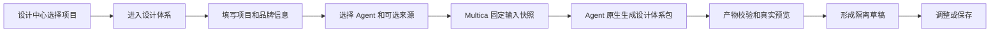
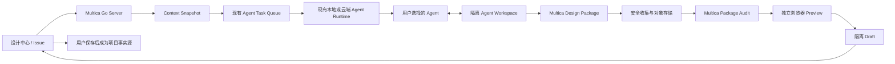

# Multica 原生设计引擎产品与技术方案

> 日期：2026-08-05
> 状态：已确认
> 范围：项目设计体系、后续在线设计任务、模板与社区资源的共同引擎基础
> 核心依据：Open Design 的产品流程、能力语义、分层资源包和质量门禁
> 明确排除：Open Design Worker、Daemon、Runtime 和第二套 Project 控制面
>
> 2026-08-12 范围更新：本方案原定后续阶段实现的 `multica.design-document/v1` 已由 DC-041 至 DC-046 纳入新的 Phase A；产物、revision、仓库 Grounding、浏览器门禁和实施子切片以 [Native Design Phase A：页面 Design Document 产品与技术方案](./2026-08-12-native-design-phase-a-design-document-design.md) 为准。本文其余原生引擎原则继续有效。

## 1. 决策摘要

Multica 不再把 Open Design 的 Worker 或 Runtime 接入产品运行链路。Open Design 仍然是本路线的核心参考实现，但参考对象从“可部署的上游二进制”调整为：

- 统一设计任务入口；
- 多来源设计体系创建；
- 确定性事实提取与 Agent 语义深化的分工；
- 稳定内核加可选扩展的分层资源包；
- 可持续调整的 Agent 工作空间；
- 可执行模板和固定输入快照；
- Package Audit、Preview/UI Kit 和坏草稿隔离。

Multica 使用现有 Project、Issue、Agent、daemon、任务队列、对象存储和设计中心，原生实现上述能力语义。Open Design 源码和固定版本实验只作为行为证据、对照样本和升级研究来源，不成为生产依赖。

这条路线的准确表述是：

> Open Design-inspired, Multica-native Design Engine.

## 2. 为什么改变运行方式

固定 Open Design Worker 的 Phase 0 已经证明以下机制有效：隔离工作空间、真实 Agent 执行、结果包、完整性摘要、Audit、Chrome Preview、取消、失败隔离、对象存储和草稿门禁。这些证据继续有效。

但把 Worker 作为正式运行依赖会引入与 Multica 核心价值无关的长期成本：

- 本地和云端必须分别分发、安装、启动和升级 Runtime；
- Multica 必须维护上游 HTTP、SSE、内存 Run 和 archive 协议的兼容性；
- 用户选择的 Agent 需要再次映射到 Open Design adapter；
- Worker 生命周期、端口、Runtime digest 和上游升级成为产品故障面；
- Project、Issue 和 Agent 已经是 Multica 控制面，再引入执行控制面会增加认知和运维复杂度。

因此，保留已验证的方法，移除专用 Worker 依赖，是本次路线调整的核心。

## 3. 方案比较

### 方案 A：直接运行 Open Design Worker

优点是上游能力复用最多，协议和 UI Kit 产物与 Open Design 一致。缺点是 Runtime 分发、升级、双执行控制面和本地/云端部署复杂度长期存在。

结论：不采用。已完成实验只作为证据保留。

### 方案 B：按 Open Design 核心语义翻新为 Multica 原生引擎

Agent 通过 Multica 已有任务体系执行；Server 固定输入、保存产物、执行确定性校验并控制草稿；设计体系和设计稿采用 Multica 自有、版本化的分层资源包。

优点是与现有 Project、Issue、Agent 和云端资产天然一致，不需要专用 Runtime，同时可以保留 Open Design 最有价值的方法。

结论：采用。

### 方案 C：先建设 Figma 类在线画布和通用 Scene Graph

优点是长期编辑能力强。缺点是第一阶段必须同时解决画布、布局引擎、组件模型、交互模型和文件格式，无法快速验证 Agent 是否能生成有价值的设计体系和设计稿。

结论：暂不采用。后续有真实编辑需求后单独立项。

## 4. 产品目标

### 4.1 当前目标

第一阶段只替换项目设计体系的生成内核，保持现有用户流程：



成功标准仍然是用户获得一套贴合项目、可看懂、可预览、可调整并可保存的设计体系，而不是 task 显示 `completed`。

### 4.2 长期目标

同一套原生引擎依次支撑：

1. 项目设计体系；
2. 设计中心首页和设计任务发起器；
3. 从 Issue 需求生成在线设计稿；
4. 私有模板和社区模板；
5. 设计稿交付、MCP 和 UI 还原。

### 4.3 非目标

- 不复制 Open Design 源码并改名维护；
- 不实现或打包 Open Design Worker、Daemon 或 Runtime；
- 不恢复模板原始 JSON Patch 路线；
- 不把 PageSpec 扩展为通用页面 DSL；
- 不要求 Agent 直接编写庞大的 Figma 或 Native Design JSON；
- 不建设第二套 Project、Issue、Agent 或权限体系；
- 不引入设计审核、接受或驳回状态；
- 第一阶段不建设首页、社区模板和设计稿在线编辑器。

## 5. 核心设计原则

### 5.1 Open Design 是行为基线，不是二进制依赖

每项核心能力必须先在 `open-design-evidence.md` 中找到固定版本源码或真实实验依据，再决定如何映射到 Multica。Multica 可以采用不同代码、部署和数据模型，但不得在没有证据时随意简化掉关键行为。

### 5.2 设计智能由 Agent 提供，确定性边界由系统提供

Agent 负责理解语义、判断设计方向、选择布局、组织组件和根据反馈修改。Server 和 daemon 负责权限、输入快照、文件边界、摘要、校验、渲染、状态和失败隔离。

系统不使用大量关键词、正则或固定组件列表代替 Agent 的设计判断。

### 5.3 产物优先于任务状态

任务完成、Agent 自评、文件存在均不是成功。只有同一输入快照产生的资源包通过结构校验、安全校验和真实渲染后，才可以形成草稿。

### 5.4 设计体系强约束，模板弱参考

下游设计任务固定遵循：

```text
Issue 需求 + 已保存项目设计体系
  > 本地 DESIGN.md 和仓库真实组件/样式
  > 用户选择的模板和社区参考
```

模板不能决定最终页面结构，也不能把旧字段、旧文案或旧数据带入新设计。

### 5.5 稳定内核加可选扩展

所有正式设计体系共享最小事实内核，但组件、页面模式、字体、资产和来源证据只在项目真实存在时增加。系统不得为了目录完整而伪造规范。

## 6. 目标架构



### 6.1 设计中心

继续负责现有创建工作台、真实任务活动、内容画布、UI Kit、自然语言调整、保存和放弃。页面不展示文件树、Runtime、Worker、archive 或技术审核状态。

### 6.2 Context Snapshot

Server 在派发前固定：

- Project 和可选 Issue 身份；
- 用户输入和目标平台；
- 用户选择的 Agent；
- 仓库分析结果及其来源文件摘要；
- Figma UI 规范、截图、Logo、品牌材料等引用；
- 当前已保存设计体系；
- 模板或社区资源版本；
- 任务协议和产物 schema 版本。

任务执行期间输入不再变化。调整任务必须固定其基线草稿或已保存包 digest。

### 6.3 现有 Agent 执行通道

设计体系任务继续使用 `agent_task_queue`、现有 daemon 和用户明确选择的 Agent。daemon 为任务准备隔离执行目录和只读来源上下文，Agent 只能向约定的输出目录写入结果。

这里不存在专用 Design Worker。所谓“设计引擎”是 Multica 对输入、Agent 工作方式、产物协议和质量门禁的组合，不是另一个长期运行进程。

### 6.4 Agent Workspace

一次任务的工作区包含：

```text
context/     固定输入和来源索引，只读
reference/   经授权的图片、设计资产和模板快照，只读
work/        Agent 中间分析和实现，可写
output/      约定的最终产物，可写
```

Agent 可以多轮读取、分析、自检和修改，但不能写回用户源仓库，也不能从最终产物引用本机绝对路径。

### 6.5 产物注册、Audit 和 Preview

daemon 有界收集 `output/`，拒绝链接、路径穿越、超限和未声明文件。Server 保存不可变对象存储归档、文件索引和 content digest，并执行：

1. schema 与必需文件校验；
2. 来源和输入快照绑定校验；
3. Token、组件和资源引用校验；
4. HTML/CSS/资产安全校验；
5. 独立 Chrome 可见性和目标页面渲染校验；
6. 需求覆盖和模板残留等任务级质量检查。

全部通过后才能原子生成或替换 `draft`。`saved` 只能由用户明确操作更新。

## 7. 原生产物协议

### 7.1 项目设计体系包

schema：`multica.project-design-system/v2`

稳定内核：

```text
manifest.json
DESIGN.md
tokens.css
source/index.json
```

可选扩展：

```text
USAGE.md
design-tokens.json
components.manifest.json
ui-kit/index.html
preview/
source/evidence/
assets/
fonts/
```

职责如下：

| 产物 | 职责 |
| --- | --- |
| `manifest.json` | schema、项目、平台、文件索引、digest、来源和生成身份 |
| `DESIGN.md` | Agent 可读的视觉意图、设计原则、组件规则和禁用边界 |
| `tokens.css` | 可直接消费的语义 Token 事实契约 |
| `source/index.json` | 来源、置信度、冲突、fallback 和输入快照摘要 |
| `components.manifest.json` | 可选的组件、状态、变体和 UI Kit 定位索引 |
| `ui-kit/` | 使用本体系 Token 和组件形成的可视化派生产物 |

`DESIGN.md` 和 `tokens.css` 是最小事实源。UI Kit、组件索引和其他格式是可重建派生产物，不得反向静默覆盖事实源。

### 7.2 在线设计稿包

schema：`multica.design-document/v1`

该协议属于后续阶段，本方案先固定方向，第一阶段不实现：

```text
manifest.json
brief.json
prototype/index.html
prototype/styles.css
prototype/app.js
assets/
coverage.json
preview/
```

`brief.json` 只表达页面、子页面、状态、弹窗、流程和需求映射，不表达逐像素布局。Agent 自由完成布局和视觉实现，避免重新形成大型页面 DSL。

`prototype/` 是可运行、可交互的设计原型，不等同于业务前端工程。它在无网络、隔离源、严格 CSP 的 iframe 中预览；接口、真实业务状态和项目工程集成仍由后续前端开发负责。

### 7.3 模板包

模板沿用 Open Design“可执行参考包”的核心语义，后续至少包含：

- manifest、来源、作者、许可证和版本；
- 预览和示例需求；
- 适用平台、场景和标签；
- 设计说明或 Agent Skill；
- 需要的设计体系或兼容范围；
- 资产、权限和输入能力；
- 固定应用快照和 source digest。

模板不能直接覆盖项目设计体系，也不能被 Agent 当作必须保留的页面骨架。

## 8. Agent 工作方式

一次设计体系生成在同一个 Agent 会话中完成以下内部阶段：

1. 读取输入快照并建立来源清单；
2. 区分真实事实、冲突、推断和 fallback；
3. 形成设计方向和 Token 契约；
4. 按项目实际需要生成组件、状态和 UI Kit；
5. 在本地工作区运行产物检查和预览；
6. 修正后输出最终资源包和完成摘要。

这些阶段通过任务上下文、内置 Skill 和产物协议约束，不要求用户操作多步表单，也不由 Server 使用关键词规则模拟设计推理。

调整任务必须基于固定包 digest：

- 整体调整可以修改事实源和全部派生产物；
- 章节或组件调整可以缩小 Agent 关注范围，但仍需维护包的一致性；
- 失败时保留调整前草稿；
- Agent 不得只修改 UI Kit 表面而不更新对应规则或 Token。

## 9. 质量门禁

### 9.1 设计体系门禁

- 必需文件存在且符合大小、路径和媒体类型约束；
- `DESIGN.md`、Tokens 和 UI Kit 不互相冲突；
- UI Kit 实际使用声明的 Tokens；
- 来源索引可以区分事实、推断和 fallback；
- 组件和页面模式只在有来源或用户需求时出现；
- Chrome 中存在真实可见内容，资源完整且无异常溢出；
- 首次生成和每次调整均绑定输入与基线 digest。

### 9.2 设计稿门禁

后续在线设计任务继续复用 PageSpec 阶段已经证明有价值的检查，但不复用其通用编译器：

- Issue 需求覆盖；
- 模板残留；
- 页面、子页面、状态和弹窗关系；
- 项目设计体系一致性；
- 文本溢出、重叠、越界和空白；
- 关键交互可触发；
- 真实页面与上一次结果确实发生预期变化。

### 9.3 成功判定

```text
Agent Task completed
  + 产物安全收集成功
  + Package Audit 通过
  + Preview/UI Kit 真实渲染通过
  + 输入和 digest 一致
  = 可用 Draft
```

任何单一条件都不能代替最终成功。坏草稿不能自动保存，也不能自动推进 Issue。

## 10. 数据与生命周期

第一阶段优先复用：

- `project_design_system` 作为项目设计体系身份和状态；
- `project_design_system_package` 的 `draft` / `saved` 槽位；
- `agent_task_queue` 作为生成和调整执行记录；
- 现有对象存储、WebSocket/Query 失效和设计中心 API。

第一阶段不新增通用 `design_run` 表。只有设计体系和在线设计稿共同需要独立于 Agent Task 的长期执行历史时，才单独设计该实体。

现有 `open_design_run` 和 Runtime 专属字段停止扩展。迁移初期保留表和历史证据，不做破坏性删除；原生链路稳定并完成数据盘点后，再提交独立清理方案。

生命周期继续使用：

```text
未建立 -> 生成中 -> 草稿 -> 已保存
```

失败是一次操作结果，不是长期审核状态。调整中的草稿与最近一次已保存体系隔离，下游只读取 `saved`。

## 11. 安全边界

- 源仓库只读，Agent 只写隔离工作区；
- 输出拒绝符号链接、硬链接、路径穿越和绝对路径；
- 文件数量、单文件大小和总包大小有明确上限；
- 归档进入对象存储前计算稳定 digest；
- HTML/UI Kit 使用无同源权限的 sandbox iframe；
- 第一阶段 UI Kit 禁止任意脚本和网络访问；
- 后续交互原型允许脚本时，必须独立 origin、严格 CSP、禁网并限制能力；
- 来源快照不得包含凭据、绝对路径、完整源码和未授权资源；
- 本地和云端 Agent 必须遵循同一输入与输出协议。

## 12. 现有代码处理边界

### 12.1 直接保留

- 设计中心信息架构和项目 Tab；
- 项目设计体系创建、生成态、内容画布、调整、保存和放弃交互；
- 用户选择 Agent；
- 只读仓库分析和参考资料输入快照；
- `draft` / `saved` 隔离与原子保存；
- 安全 HTML 预览、对象存储、digest、Audit 和 Chrome 验证经验；
- 任务取消、Agent 失败和坏草稿隔离。

### 12.2 翻新后复用

- 当前固定 `DESIGN.md`、`tokens.css`、`components.html` 收集器升级为版本化分层资源包；
- 当前 Markdown、Token 和 HTML 解析器只保留确定性校验职责，不承担语义归类；
- Open Design archive-backed Preview 的安全读取方式可以抽象为通用 Design Package 读取方式；
- Supervisor 中与上游无关的输入快照、对象存储、终态和证据设计可以迁移到原生任务链路。

### 12.3 停止进入主线

- Open Design Worker HTTP/SSE client；
- Runtime resolver、Runtime archive installer 和 `active.json`；
- Open Design adapter 映射和 worker preflight；
- worker Run 恢复、端口和进程托管；
- Open Design 固定制品、OCI 和桌面 Runtime 分发；
- 仅为上游 result package 存在的协议字段。

当前 `codex/open-design-native-slots` 分支不合并到本路线。已有已提交 Worker 代码先通过 feature flag 保持关闭，不在本次决策提交中删除。

## 13. 分阶段实施

### 阶段 0：决策与代码盘点

产物：

- 权威决策更新；
- Open Design 到 Multica 的能力映射；
- Worker 专属代码与可复用质量门禁清单；
- 第一阶段实施计划和回滚边界。

验收：没有业务代码变化，没有 Worker 分支合并，主工作区用户改动不受影响。

### 阶段 1：原生项目设计体系闭环

范围：

- 设计体系首次生成和调整改用现有 Agent 执行通道；
- Agent 输出 `multica.project-design-system/v2`；
- Server 完成安全收集、Audit、Preview 和 draft gate；
- 现有内容画布、UI Kit、保存和放弃继续工作；
- Worker feature flag 保持关闭。

验收样本固定为 CRM 项目。必须证明 Agent 读取了真实仓库和输入资料，UI Kit 与 CRM 的颜色、字体、密度、组件和页面模式存在可见一致性，并通过页面、API、持久化和 Chrome 视觉证据共同验收。

### 阶段 2：设计中心首页与任务发起器

首页参考 Open Design 的统一入口，但必须选择或创建 Multica Project、关联 Issue 并选择 Agent。首页展示最近设计、进行中任务、设计体系缺失提示和模板入口，不创建平行任务世界。

### 阶段 3：在线设计稿生成

使用 `Issue + saved design system + repository facts + optional template` 生成 `multica.design-document/v1`。首先验证页面关系、可交互原型和真实视觉结果，再讨论 Native Design JSON 转换。

### 阶段 4：私有与社区模板

按 Open Design 可执行模板的语义实现来源、许可证、版本、预览、Skill、资产和固定应用快照。模板始终是弱参考。

### 阶段 5：设计交付

将已保存在线设计稿接入现有设计详情、MCP、UI Agent 还原和前端交付。该阶段复用当前主线 A，不重新设计 Issue 协作模型。

## 14. 第一阶段真实验收矩阵

| 验收项 | 必须证据 |
| --- | --- |
| 输入真实进入任务 | 固定 Context Snapshot、Agent 会话或任务上下文 |
| Agent 真正工作 | 活动事件、输出文件变化和最终产物索引 |
| 项目事实被使用 | 来源索引、仓库相对来源和 CRM 特征映射 |
| 设计体系有价值 | 真实 UI Kit 与 CRM 当前页面并排视觉检查 |
| 包一致 | Audit 无阻断错误，Token 与 UI Kit 引用可核对 |
| 页面可见 | Chrome 像素和资源加载验证，不接受空 DOM |
| 草稿隔离 | 坏产物不创建或覆盖 draft，saved 不变化 |
| 保存可靠 | 用户保存后原子替换，刷新后内容和 digest 一致 |
| 无 Worker 依赖 | 机器未安装 Open Design Runtime 时完整流程仍通过 |

## 15. 风险与控制

### Agent 生成质量不稳定

控制：多来源事实快照、分阶段 Agent Skill、固定产物协议、真实项目样本和视觉门禁。不能通过继续增加关键词匹配来掩盖质量问题。

### 自有协议演变成大型 DSL

控制：设计体系只固定最小事实内核；设计稿 `brief.json` 只表达语义关系，布局由可运行原型表达。没有第二个真实消费端前不增加字段。

### UI Kit 看起来完整但不贴合项目

控制：来源置信度与 fallback 显式记录；CRM 验收必须与真实页面并排；无来源的组件和模式不得为了丰富度自动补齐。

### 本地与云端行为漂移

控制：两者使用同一 Context Snapshot 和 Package schema；只允许本地或云端 Agent runtime 的资源访问方式不同，成功门禁和服务端保存逻辑完全一致。

### 任意 HTML 或脚本风险

控制：第一阶段 UI Kit 静态、禁脚本、禁网络；交互设计稿在后续独立安全方案中启用隔离 origin 和严格 CSP。

## 16. 方案完成条件

本方案经过用户复核后，下一步只为“阶段 1：原生项目设计体系闭环”编写实施计划。首页、在线设计稿、社区模板和设计交付分别在前一阶段通过真实验收后再展开，不在一个长期任务中同时推进。
