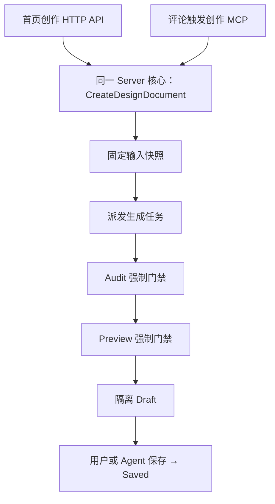
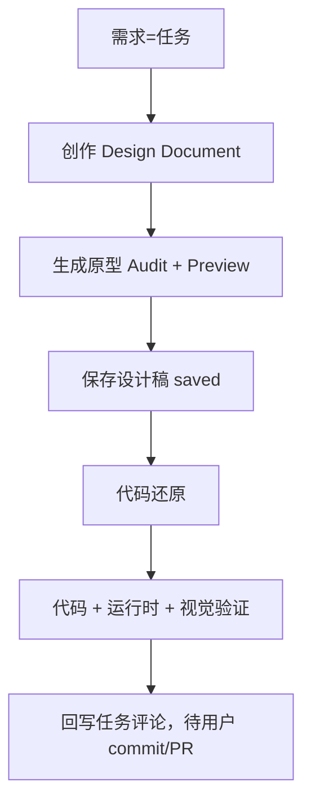

# 任务双向创作关联与 Agent 自动化链路方案

> 状态：产品与技术方案已确认，待用户审阅书面 Spec
> 日期：2026-08-27
> 适用范围：任务反向创作、任务/设计稿双向关联、需求到代码的 Agent 自动化编排、全链路 MCP
> 当前基线：`main@a7606af71`
> 前置方案：`2026-08-26-design-center-project-repository-views-m1-design.md`、`2026-08-26-unified-design-asset-implementation-design.md`

## 1. 摘要

Multica 已具备“首页创作时可关联任务”的单向能力，以及“设计稿交付给实现任务”的交付能力。本方案补齐反向入口：**从一个任务直接发起设计创作**，并让 Agent 可以在一个任务内，通过统一的 MCP 把“需求 → 创作 → 原型 → 设计稿 → 代码还原 → 交付”串成一条可追踪、可接管、可恢复的链路。

反向创作不新建脱离任务系统的执行实体。它挂在一个任务上，复用任务评论和各环节 MCP。评论触发的创作与首页创作共享同一个 Server 端创建与生成核心，不旁路 Audit、Preview 和 saved-only 门禁。

自动化编排模型采用“默认自动推进、不确定才停、可配置全自动”：每个环节都是可追踪节点，同时保留“人工确定”与“机器/Agent 确定”两种权利；链路稳定后，用户可以把确认点逐步交给 Agent。

## 2. 当前实现事实

### 2.1 已有单向关联

- `design_document.issue_id` 已存在；
- 首页创作可选择已有任务或自动创建伴生任务；
- `CreateDesignDocument` 接受 `issue_id` 和 `create_issue`；
- `IssueDestinationSetting` 提供任务选择与伴生任务开关。

### 2.2 任务侧已有展示

- `IssueDesignDocumentsSection` 按 `issue_id` 展示关联设计文档，点击进入 Design Document 详情页；
- `IssueDesignRestoreSection` 提供从任务还原已有设计稿到代码的能力。

### 2.3 已有交付

- 设计稿可交付给同项目任务；
- 交付只保存 `saved revision`；
- 交付不修改任务状态；
- 守护进程下载、校验并只读展开设计包。

### 2.4 缺口

- 缺少“从一个任务发起创作”的反向入口；
- 缺少创作 MCP 让 Agent 在评论中真正创建 Design Document；
- 缺少查询生成状态和保存草稿的 MCP；
- 缺少把创作、保存、还原串成一条链的编排约定。

## 3. 产品原则

### 3.1 一个任务承载一条交付链

任务就是需求与交付的上下文。设计、实现和验证都回写到该任务评论时间线，不另建“流水线”实体。

### 3.2 双向关联

```text
首页创作 → 关联任务（已有）
任务 → 发起创作（本方案补齐）
```

两个方向最终落到同一条 `design_document.issue_id` 关系，不产生两套关联模型。

### 3.3 每环节保留人工与机器确定权

每个环节既支持用户手动操作，也支持 Agent 通过 MCP 操作。先打通端到端，再按真实链路逐步调整默认人工/自动配比。

### 3.4 不旁路质量门禁

评论触发的创作和还原必须经过：

- Audit；
- Preview；
- saved-only；
- 仓库权限与项目归属校验；
- 运行时和视觉验证。

### 3.5 设计不推进任务状态

创建或保存设计稿不自动改变任务状态（DC-045）。只有用户明确推进实现、提交或交付时，任务才前进。

## 4. 任务反向创作入口

### 4.1 位置

任务详情右侧栏新增「UI 设计」区块，与现有「UI 还原」并列。

### 4.2 交互

```text
任务右侧栏「UI 设计」
├── 选择设计智能体（必选）
├── 选择仓库（可选）
├── 选仓库 → 自动带出该仓库专属设计体系；无则留空
├── 设计体系可切换：工作区已保存体系 + 官方体系
└── 交给 Agent → 生成创作 Prompt 到评论输入框
```

用户发送评论后，智能体调用创作 MCP。点击“交给 Agent”不自动发送评论、不直接启动生成。

### 4.3 预填与推导

| 项 | 规则 |
| --- | --- |
| brief | 任务标题 + 描述，可在 Prompt 中编辑 |
| 项目 | 从任务带入，锁定 |
| 任务（issue_id） | 当前任务，锁定 |
| 仓库 | 用户可选 |
| 设计体系 | 仓库专属自动带出，可切换 |
| recipe | 固定 `ui-mockup` |
| platform | 仓库专属体系 platform → 否则 `web`，可切换 |
| create_issue | `false`（任务已存在） |

### 4.4 设计体系规则

- 该仓库有专属体系 → 自动带出；
- 该仓库没有专属体系 → 留空，不自动带项目通用；
- 可切换范围：工作区已保存体系 + 官方体系；
- 不做项目通用体系自动回落。

## 5. 评论触发创作的执行链路

### 5.1 共享核心



评论触发与首页创作只入口不同，核心、状态机、门禁完全一致。

### 5.2 落点

- 生成通过 Audit + Preview 后停在 `draft`；
- 任务侧卡片显示 `running → draft → saved`；
- 用户点击卡片进入 Design Document 详情页预览、调整、保存；
- 只有 `saved` 才能被下游还原或交付使用。

### 5.3 任务状态

反向创作不推进任务状态。创建设计稿、生成草稿、保存草稿都不改变任务状态。

## 6. 任务侧卡片

复用并扩展 `IssueDesignDocumentsSection`：

- 按 `issue_id` 自动展示关联的 Design Document；
- 显示实时状态 `running / draft / saved / failed`；
- 点击进入 Design Document 详情页；
- 由系统渲染链接，不依赖 Agent 手写 URL；
- 保存后提供“继续还原到代码”入口。

## 7. Agent 自动化编排模型

### 7.1 编排载体

挂在任务上，用任务评论 + MCP 串起，不新增“链”实体。

### 7.2 默认推进



每个环节完成后尝试进入下一环节。

### 7.3 人工与机器确定权

每个节点同时保留两种推进方式：

- 人工确定：用户在详情页或任务侧手动操作；
- 机器/Agent 确定：Agent 通过 MCP 自动推进。

不确定、阻塞、冲突、验证失败时暂停；用户接管后可改需求、设计或代码，再交还 Agent。

### 7.4 全自动模式

链路稳定后，用户可把确认点设为“自动”，实现全权交给 Agent。提交/推送/建 PR 仍保持人工确认，除非用户额外授权。

### 7.5 失败保护

任一环节失败不丢已产生物，可从最近里程碑恢复：

- 创作失败 → 任务侧显示可重试；
- 生成失败 → 保留输入，Design Document 停在 failed；
- 保存失败 → 草稿保留，最近 saved 不变；
- 还原失败 → 保留 dirty worktree 和已生成代码，输出映射与阻塞；
- 取消 → 保留已完成结果和差异摘要。

## 8. 全链路 MCP 清单

| MCP | 作用 | 现状 |
| --- | --- | --- |
| `multica_design_create_document` | 创作 + 派发生成 | 新增 |
| `multica_design_get_document_status` | 查生成状态 running/draft/saved/failed | 新增 |
| `multica_design_save_document` | 把 draft 保存为 saved | 新增，复用保存核心 |
| `multica_design_get_implementation_context` | 还原上下文 | 统一还原 Spec 已定义 |
| 任务评论回写 | 各环节结果汇报 | 已有 |

### 8.1 复用约束

- `create_document` 复用 `CreateDesignDocument` 核心；
- `save_document` 与详情页保存按钮走同一保存核心；
- `get_implementation_context` 遵守 saved-only 和固定 revision；
- 所有 MCP 不旁路 Audit、Preview、权限和项目归属校验。

### 8.2 状态感知

Agent 通过 `multica_design_get_document_status` 感知异步生成完成，再决定是否保存或还原。不通过轮询任意 HTTP 或猜测结果。

## 9. 实施切片

### Slice 1：反向创作入口

- 任务右侧栏「UI 设计」区块；
- 智能体、仓库、设计体系选择；
- 创作 Prompt 生成并注入评论草稿；
- brief 预填与 recipe/platform 推导。

### Slice 2：创作 MCP 与共享核心

- `multica_design_create_document`；
- `multica_design_get_document_status`；
- `multica_design_save_document`；
- 与首页创建、保存核心对齐；
- 任务侧卡片状态展示。

### Slice 3：全链路编排

- 需求 → 创作 → 原型 → 保存 → 还原 → 验证；
- 任务评论驱动；
- 人工/机器确定权；
- 失败、暂停、接管、恢复。

### Slice 4：全自动模式与完整闭环

- 确认点配置；
- 全自动推进；
- 提交/推送仍人工确认；
- 端到端真实链路验收。

## 10. 验收矩阵

至少覆盖：

- 任务右侧栏出现「UI 设计」；
- 选择智能体和仓库，设计体系自动带出；
- 生成 Prompt 注入评论框且不自动发送；
- 发送后创建 Design Document 并关联任务；
- 任务状态不被推进；
- 生成通过 Audit + Preview 进入 draft；
- 任务侧卡片显示 running → draft；
- 点击卡片进入详情页并手动保存；
- `save_document` 与手动保存结果一致；
- Agent 查询状态后自动保存；
- 保存后调用 `get_implementation_context` 还原代码；
- 代码写入工作区后停在提交前；
- 任一环节失败可从最近里程碑恢复；
- 用户接管后能交还 Agent；
- 全自动模式跑通端到端。

## 11. 门禁

- 评论触发与首页创作共享同一 Server 核心；
- 不旁路 Audit、Preview、saved-only；
- 不自动发送评论、不自动推进任务状态；
- 不自动提交、推送或建 PR；
- 设计体系不做项目通用自动回落；
- MCP 不返回对象存储 key 或绝对路径；
- 失败不丢已产生物；
- 每个节点保留人工与机器确定权；
- 结构化结果是事实源，评论是面向人的摘要。

## 12. 明确非目标

本方案不包含：

- 新建独立“流水线”实体；
- 自动提交、推送或建 PR（除非用户额外授权）；
- 覆盖用户无关 dirty worktree；
- 修改任务状态作为设计动作的副作用；
- Open Design 与 Multica Design 结果对比（最后单独做）；
- 设计稿与 Figma 相同内容自动匹配。

## 13. 已确认决策

- 反向创作入口为任务右侧栏「UI 设计」区块；
- brief 自动带入任务标题 + 描述，可编辑；
- 仓库可选，选仓库自动带出专属设计体系，可切换；
- recipe 固定 `ui-mockup`，platform 自动带出可切换；
- 评论触发创作复用 CreateDesignDocument 核心；
- 创作停在 draft，任务侧卡片进入详情页手动保存；
- 设计动作不推进任务状态；
- 编排采用“默认自动推进、不确定才停、可配置全自动”；
- 载体为任务评论 + MCP，不新建链实体；
- 每个节点保留人工与机器确定权；
- MCP 清单为 create_document / get_document_status / save_document / get_implementation_context / 评论回写。
